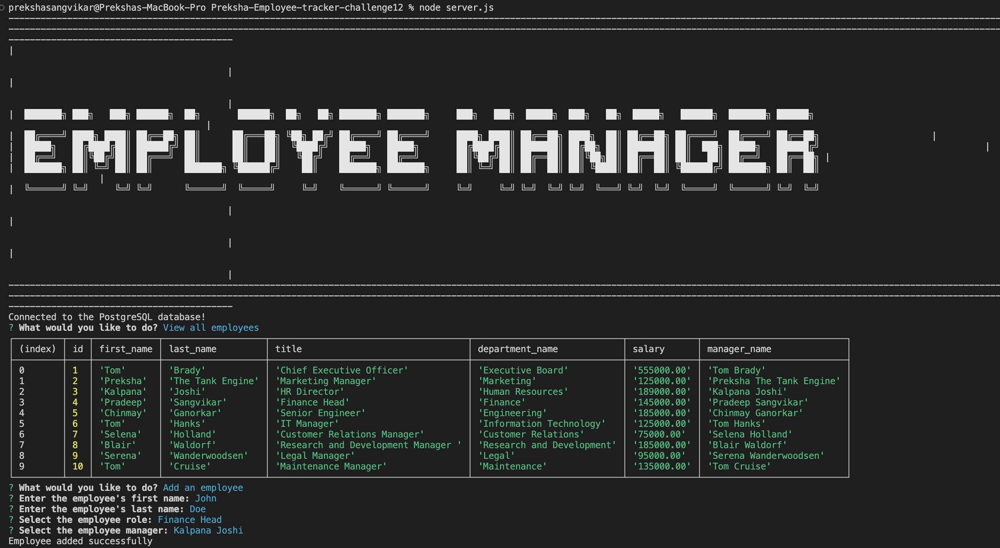
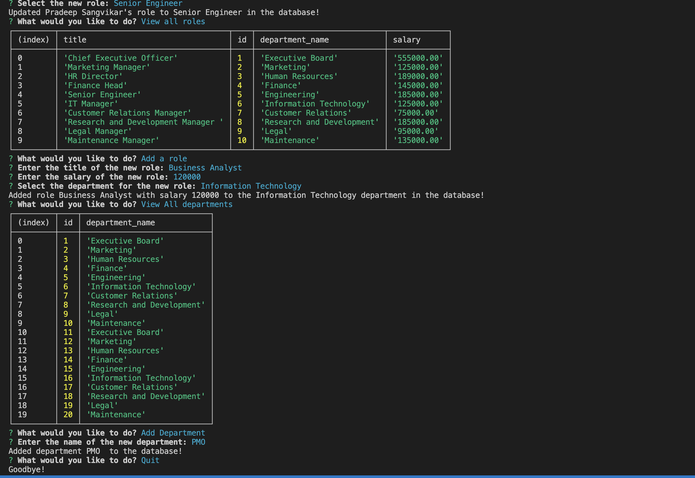

## Preksha-Employee-tracker-challenge12


## Description

The Employee Tracker is a command-line application built using Node.js and PostgreSQL that allows users to manage employee data within a company. Users can view, add, and update employees, roles, and departments, making it easier to track and manage employee information and organizational structure.

## Table of Contents

* [Description](#description)

* [Usage Instructions](#usage-instructions)

* [Installation](#installation)

* [Features](#features)

* [Screenshots](#screenshots)

* [Demo](#Demo)

* [Questions](#questions)


## Usage Instructions 

1. Clone the repository to your local machine using:
   ```bash

   git clone git@github.com:Preksha2408/Preksha-Employee-tracker-challenge12.git

2. Navigate to the project directory  

   cd Preksha-Employee-tracker-challenge12/

3. Install necessary dependencies 

   " npm install "

4. Ctrl-right-click on server.js . 

    * Open in integrated terminal

    * Type  psql -U postgres -d employeetracker_db -f ./db/schema.sql

    * Enter your password 

    * Type psql -U postgres -d employeetracker_db -f ./db/seeds.sql

    * Enter your password 

    * Type node server.js 


## Installation 

* npm i inquirer@8.2.4

* npm i cfonts

* npm i pg


## Features

* View all employees with their roles, salaries, and managers.

* Add new employees, roles, and departments.

* Update an employee's role.

* View all roles and departments.

* Quit the questions 

## Technologies Used

* Node.js: JavaScript runtime for executing server-side code.

* PostgreSQL: Relational database for storing employee data.

* Inquirer.js: CLI tool for prompting user input.

* CFonts: Library for adding stylish text in the console.


## Usage

* Upon running the application, you will be prompted with a menu to choose an action. Available options include:

* View all employees: Displays a list of all employees with their roles, salaries, and managers.

* Add an employee: Prompts you to enter details for a new employee and adds them to the database.

* Update an employee role: Allows you to change the role of an existing employee.

* View all roles: Displays a list of all roles with their titles, salaries, and associated departments.

* Add a role: Prompts you to enter details for a new role and adds it to the database.

* View all departments: Displays a list of all departments.

* Add a department: Prompts you to enter the name of a new department and adds it to the database.

* Quit: Exits the application.


## Screenshots 

* 

* 


## Demo 

* 


## Questions 

For questions or further information, please contact me:

* Email - [prek.ps37@gmail.com](prek.ps37@gmail.com)

* GitHub - [Preksha2408](https://github.com/Preksha2408/Preksha-Employee-tracker-challenge12.git)
